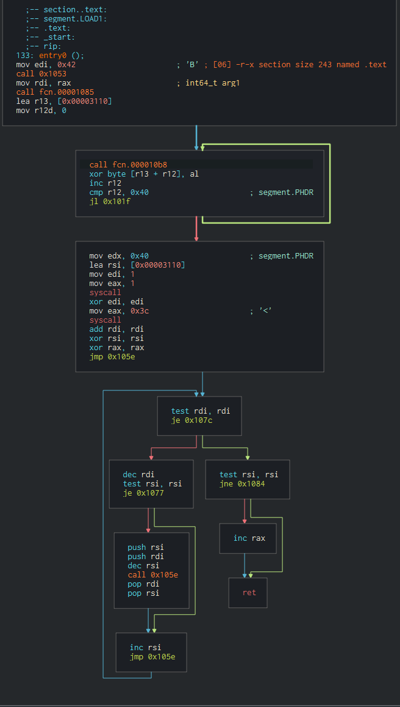
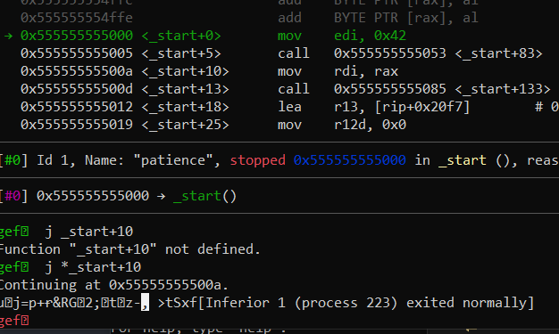
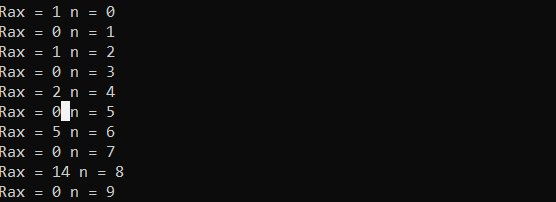
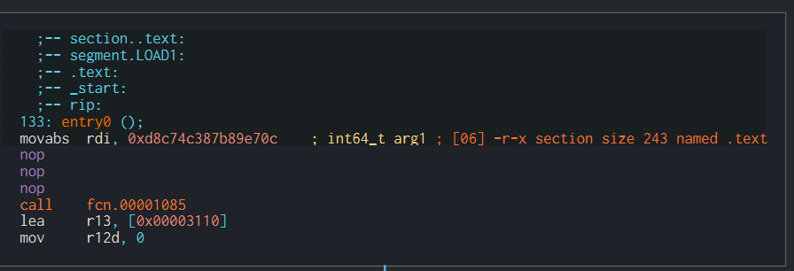

# Patience


If we immediately try to run the program it will just hang and not do anything. So lets do some static analysis since dynamic analysis won't yield much now.



# Breaking down the problem
One interesting thing is that the call to 0x1053 isn't really a traditional call. But what is even more interesting is the fact 0x1053 is a recursive function which probably explains why the program takes so long to run.
My initial instinct was just to jump over that recursive function.  
  
Nope. However, it does print out something which is likely the flag. Note that right after our recursive function we move it into `rdi` which means that the result of the print is likely dependent on the result of the recursive function. So we have to figure out what the recursive function is doing.

# Recursive function breakdown

It is not too time consuming to just break this down by hand but this is pretty tricky to work out so I converted it to a python script.
```
rax = 0

rdi = 0x42
rsi = 0

def recurse(a,b):
    global rax
    while a != 0:
        a -= 1
        if b != 0:
            recurse(a,b-1)
        b += 1

    if b == 0:
        rax += 1

recurse(rdi*2, 0)
```
Okay now we could break this down by hand but I am terrible at recursion. So I just ran it with the argument `0x42*2`. Obviously, it doesn't work. But if we run it wit smaller values of `n` we notice something interesting.



If we ignore the `n`'s that yield zeroes and plug that sequence into Google it tells us that is the `Catalan Number` sequence. Now I don't know what that is but what I do know is that somebody out there has a calculator for it. So going back to the assembly we see that it is trying to calculate the 42nd Catalan Number. A calculator tells us it is `5632681584560312734993915705849145100`. However this is way too big as `rax` is a 64 bit register which means we have to take `5632681584560312734993915705849145100 mod (2^64)` which is `15620537638032369420`. Now we have solved our recursive function and we need to patch the binary.

# Patch the binary

Open this up the binary in your favourite disassembler and then path out `call 0x1053` with `mov rdi, 15620537638032369420`. Remember to nop out everything else before the next call.


Run the binary and there is the flag!

`nactf{d1d_y0u_kn0w_y0u_ju5t_c4lcul4t3d_th3_66th_c4t4l4n_numb3r}`
