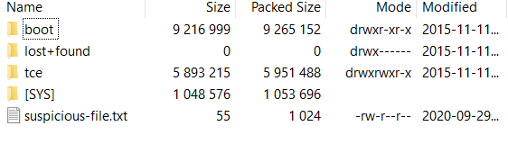
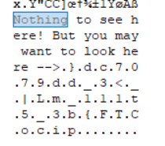

# Pitter, Patter, Platters picoCTF 2020 Mini-Competition

We are given a file called `suspicious.dd.sda1`. A quick Google search tells us that this is a disk image file which fits the title of the challenge. Trying to actually mount it to my computer didn't work out well but luckily 7-zip is actually capable of opening disk image files. Here are the contents of the disk image.

Nothing really interesting in the disk image aside from one file, suspicious-file.txt. Opening up the file shows that there isn't anything interesting there neither does opening the file in a hex editor doesn't show anything either.

So there isn't anything interesting here but lets throw the disk image into the hex editor. The text file gives a hint so my suspicion is that the flag is located right next to the end of the text file. Searching for the string in the hex editor yields something interesting.

Well it looks like the flag is just sitting there. Decrypt it and we are done.

`picoCTF{b3_5t111_mL|_<3_dd9707cd}`
